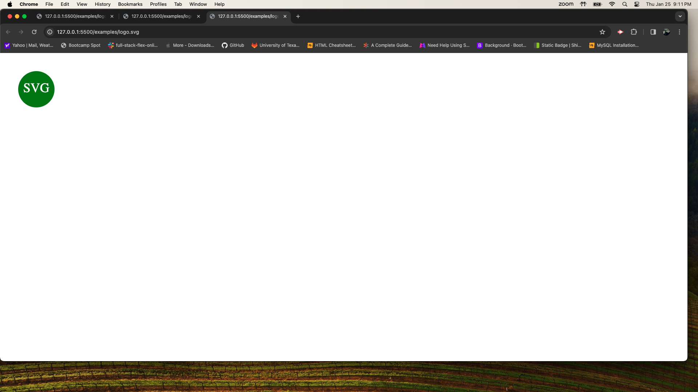
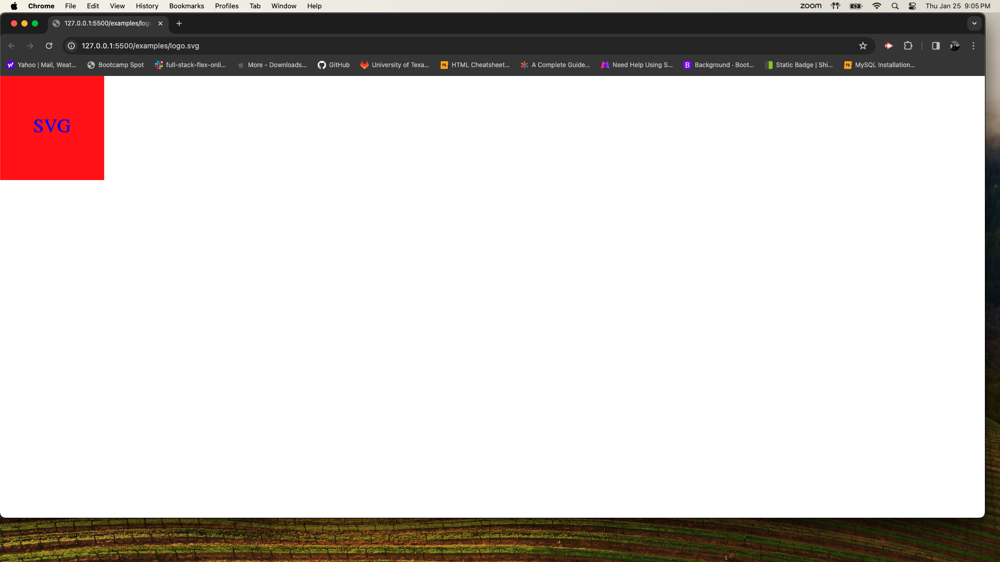
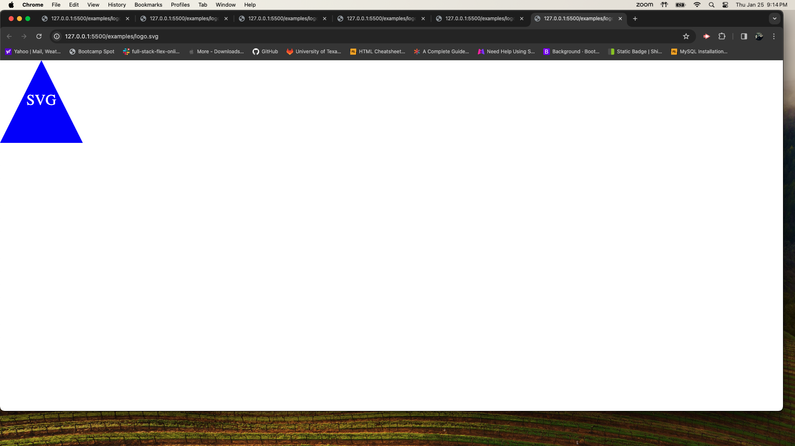

# SVG-Logo-Generator

## License
  

  This project is licensed under the MIT license.
  
<a href= "https://choosealicense.com/licenses/mit/">link to MIT license</a>

## Description
To generate a SVG logo from user input.

## Table of Contents
- [License](#license)
- [Installation](#installation)
- [Usage](#usage)
- [Contributing](#contributing)
- [Tests](#tests)
- [Questions](#questions)

## Installation
inquirer v8.2.4 & jest for running the unit tests.

## Usage
To copy path from SVG-Logo-Generator file and cd into path of index.js. Once in the correct file, use the function node index.js to promt questions. Once you are finished ansering questions, a SVG file is generated in the examples folder with users personal input.

## Contributing
Eric Reyna

## Tests
Repeat the steps for usage instructions to enter into correct file into terminal. However, to invoke a test run use the folling function npm run test in terminal where a series of tests will be run and show you if your code passes or fails. Also I will be adding a recording walk thru of me using the application and running test s.

## Questions
For additional questions, you can reach me through:
- GitHub: [Follow me on GitHub at Ereyna21](https://github.com/Follow me on GitHub at Ereyna21)
- Email: ereyna21075@gmail.com for any additional questions.

Repository Link:
https://github.com/Ereyna21/SVG-Logo-Generator

Live Link:
https://ereyna21.github.io/SVG-Logo-Generator/

Recording Link:
https://drive.google.com/file/d/1c4QTiSIq7n3FnRx1N1OpbpwZd3WpGrD0/view

